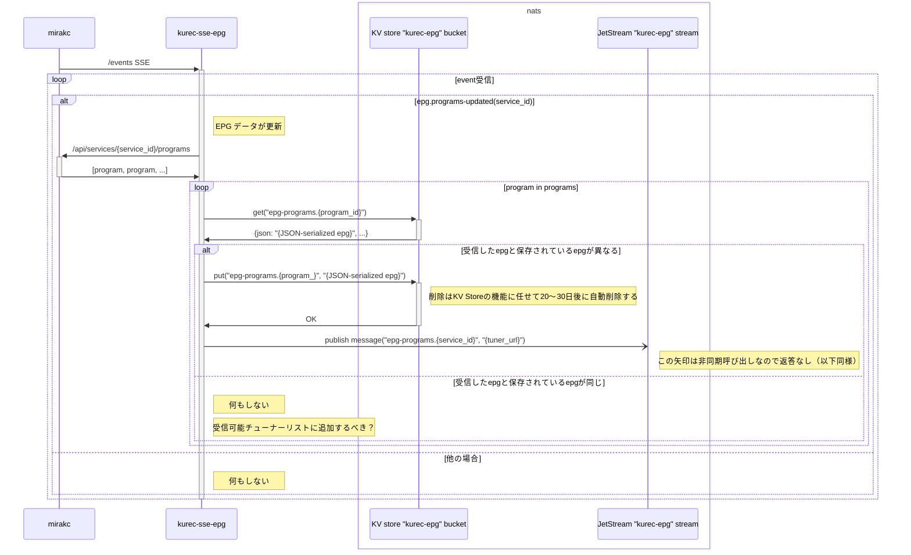
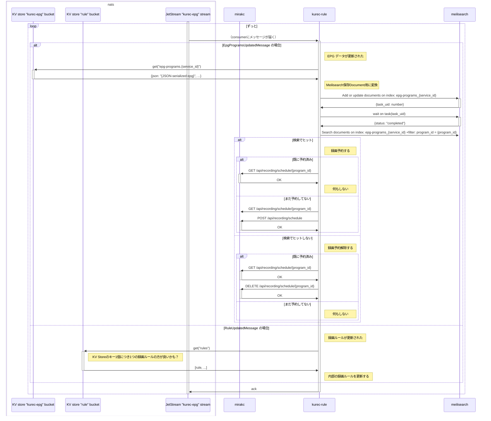
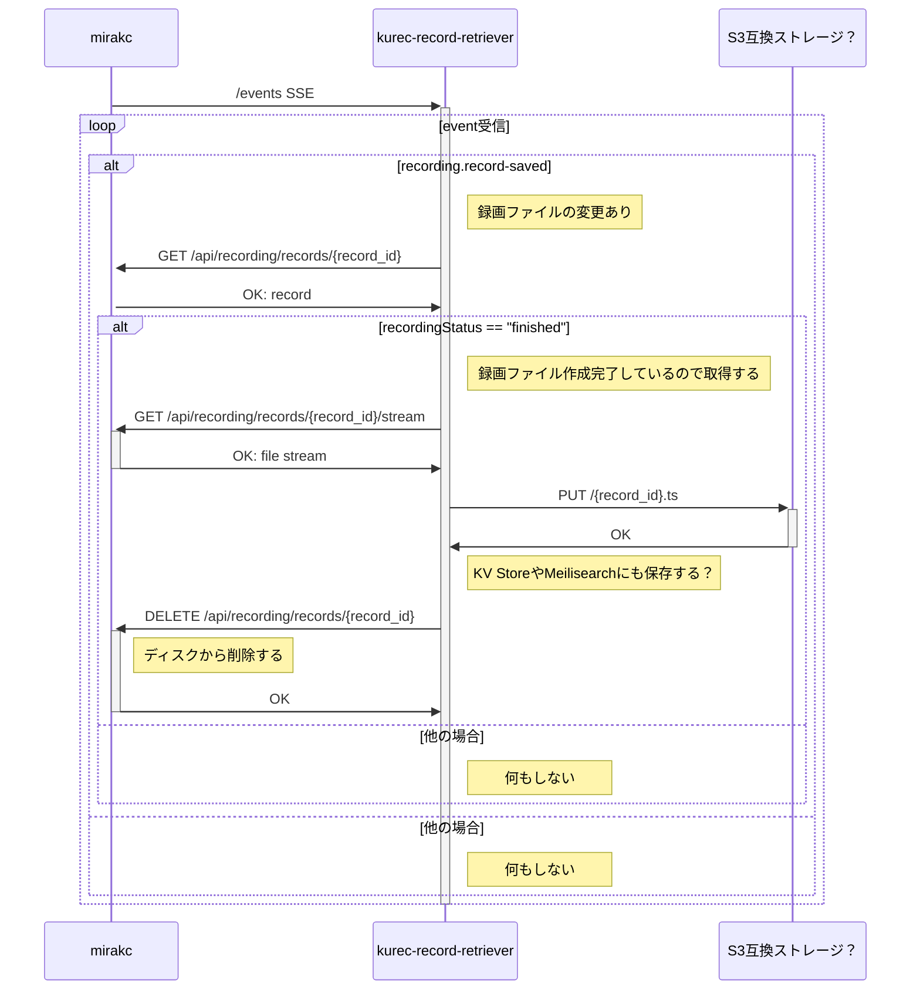

# シーケンス図ドキュメント

## kurec-sse-epg

mirakc の `/events` SSE を受信して EPG データを取得し、NATS JetStream KV Store に保存/NATS JetStream Stream に publish する。

## kurec-rule

NATS JetStream Stream からイベントを受信して何らかの処理をする

- EpgProgramsUpdatedMessage: EPG データが更新されたので Meilisearch に保存して検索し、録画予約の更新をする
- RuleUpdatedMessage: 録画ルールが更新されたので内部の録画ルールを更新する

## kurec-record-retriever

mirakc の `/events` から SSE で録画ファイル作成完了イベント(recording.record-saved)を受信して、mirakc から録画ファイルを回収する

