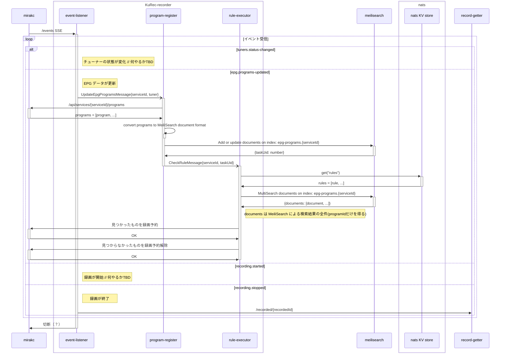

# シーケンス図ドキュメント

```mermaid
sequenceDiagram
    participant mirakc
    box  KuRec-recorder
        participant event-listener
        participant program-register
        participant rule-executor
    end

    participant meilisearch

    box nats
        participant nats-kv as nats KV store
    end

    mirakc ->>+ event-listener: /events SSE
    loop イベント受信
        alt tuners.status-changed
            note right of event-listener: チューナーの状態が変化 // 何やるかTBD
        else epg.programs-updated
            note right of event-listener: EPG データが更新
            event-listener -)+ program-register: UpdateEpgProgramsMessage{serviceId, tuner}
                program-register ->>+ mirakc: /api/services/{serviceId}/programs
                mirakc ->>- program-register: programs = [program, ...]

                program-register ->>+ program-register: convert programs to MeiliSearch document format
                deactivate program-register

                program-register ->>+ meilisearch: Add or update documents on index: epg-programs.{serviceId}
                meilisearch ->>- program-register: {taskUid: number}
                program-register -)+ rule-executor: CheckRuleMessage{serviceId, taskUid}
            deactivate program-register

            rule-executor ->>+ nats-kv: get("rules")
            nats-kv ->>- rule-executor: rules = [rule, ...]

            rule-executor ->>+ meilisearch: MultiSearch documents on index: epg-programs.{serviceId}
            meilisearch ->>- rule-executor: {documents: [document, ...]}
            note right of rule-executor:  documents は MeiliSearch による検索結果の全件(programIdだけを得る)

            rule-executor ->>+ mirakc: 見つかったものを録画予約
            mirakc ->>- rule-executor: OK

            rule-executor ->>+ mirakc: 見つからなかったものを録画予約解除
            mirakc ->>- rule-executor: OK

            deactivate rule-executor
        else recording.started
            note right of event-listener: 録画が開始 // 何やるかTBD
        else recording.stopped
            note right of event-listener: 録画が終了
            event-listener ->> record-getter: /recorded/{recordedId}
        end
    end

    event-listener ->>- mirakc: 切断（？）
```
